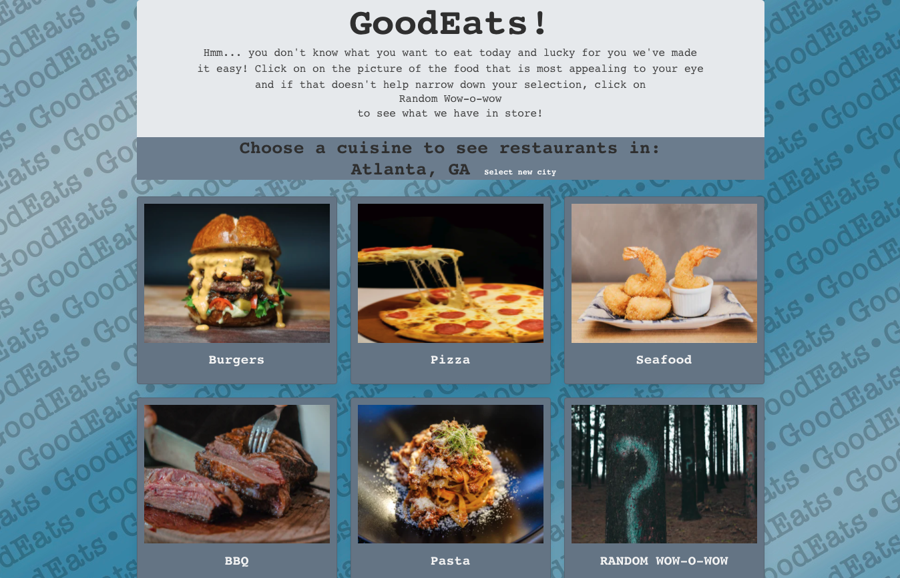

## GOOD EATS

What food would you prefer to eat at this moment?

## Motivation

When you are having a hard time deciding what you would like to eat.

## Build Status

Completed.

## Code Style

Standard.

## Screenshots

Front end view of Project:

## Tech/framework used

Bulma.com
Bootstrap.com

## Features

Costom background design. 
Unique idea of the purpose of the application. 
And choices on what to add into our project.

## Code Example

## Installation

-GetEstablishments and Spinners by Brittany:

-JavaScript Functions by Eric:

-OpenModal and BulmaCard Designs by Aliyah:

-Layout and Desing by Annemarie:

## API References

Zomato:
https://developers.zomato.com/documentation#/
MapQuest:
https://developer.mapquest.com/documentation/

## How to use?

## Credits

## Miscellaneous 

Decorated our personal VSCode program to ensure accuracy of our code while writing.
Used Trello as our guide for completing tasks from: To Do, To Doing, To Done, 
And provided the ability to have up to date comunications for all group members.
Challenge for this project was segregation of individual tasks to members. 
Colaborating on LiveShare VSCode worked easier.
